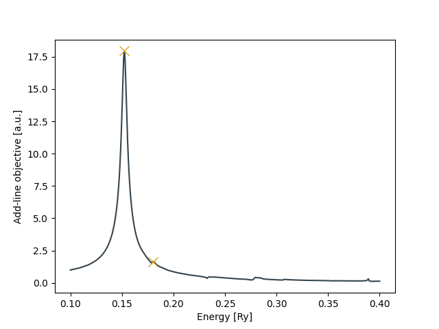
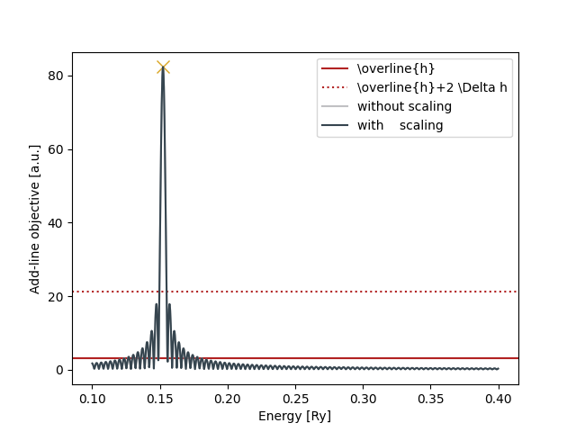
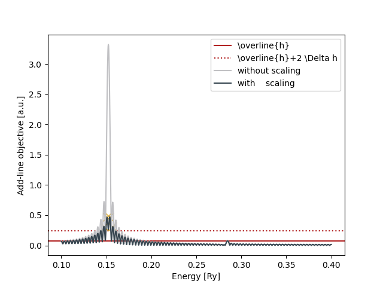
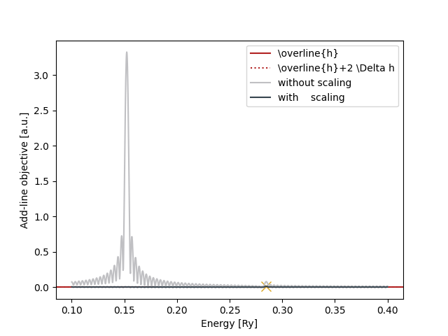

# Shortcut

For a quick fit, run

```bash
./run.sh
```

# [optional] Print help messages

- Print the general help message (any any further help messages you want)

```bash
./BTevalSpec.py -h gen
```

# Create a new eval.yaml

- [optional] Print the `new`-command's help message

```bash
./BTevalSpec.py -h new
```

- Then call

```bash
./BTevalSpec.py new
```

to create a new `eval.yaml`.

# Edit `eval.yaml`

- Print `eval.yaml`'s help message

```bash
./BTevalSpec.py -h yaml
```

- Then either
  - copy the pre-edited file `cp readmeFiles/eval.yaml.0 eval.yaml` or
  - insert the correct dipole-moment and laser-profile file and set invertPhase to `true` (since the provided laser_profile.dat lacks a factor `-1`)

# [optional] Compute Fourier and Pade spectra

- [optional] Print the `ft`-commands help message

```bash
./BTevalSpec.py -h ft
```

- Then call
  - `*_ft_[xyz].dat` contain the Fourier spectrum (real- and imaginary parts)
  - `*_pw_[xyz].dat` the respective power spectrum

```bash
./BTevalSpec.py ft
```

- [optional] Print the "pade"-commands help message

```bash
./BTevalSpec.py -h pade
```

- Then call
  - `*_pade_[xyz].dat` contain the Pade spectrum (real- and imaginary parts)

```bash
./BTevalSpec.py pade
```

- Note that `eval.yaml` is updated and now contains information about the parameters used to compute the spectra.
Moreover, the the `calc` flags are now set to `false` so that the spectra are not computed again in following calls to BTevalSpec.py but read from the files.
If you want to change those parameters and re-compute the spectra
  1. Change the respective parameter
  2. Set the respective calc-flag to true again
  3. Call the above commands again
You can now plot/inspect the spectra, e.g., to find a good fit range.

# [optional] Make an initial guess
  
- Call

```bash
./BTevalSpec.py --guess=pade guess
```

for a Pade guess or

```bash
./BTevalSpec.py guess
```

  for an Fourier-transform (FT) guess (reset the `eval.yaml` before computing the FT guess if you computed the Pade guess before).

- Both commands generate additional files `*_fit_[xyz].dat` and `*_err_[xyz].dat` that show the current fit and residue (=difference between data and fit).
  Moreover, both commands show the add-line objective function that is used to determine new lines:
  - Pade:
  
  

  - FT:

  

  The Pade guess finds one additional excitations that is not seen in the FT guess.
  Since the latter corresponds to the raw data and the Pade spectrum can show artifacts, one should treat the second line with care.
  One can also use the `--thres=<threshold>` option to adjust the threshold with which peaks are accepted as lines.
  The corresponding option for the FT guess is `--nsig=<nsigma>`.
- Finally, the eval.yaml is updated and now contains the guesses (see `eval.yaml.FTguess` and `eval.yaml.PadeGuess`).
  The comprehensive fit error after the FT guess is already quite good with about `0.04`.

# Fit excitations

- If you did not explicitly compute the FT/Pade spectra, this is done automatically in the following.
- If you already did an initial guess, you can call

```bash
./BTevalSpec.py fit
```

  to fit those excitations and exit without adding further ones.

- Otherwise, you can call

```bash
./BTevalSpec.py --niter=1 fit
```

  to add one batch of excitations.
  Both commands first fit the existing excitations (which can be suppressed using the `--skip` option), print important measures such as the excitation energies, oscillator strengths, and the comprehensive fit error (between 0 and 1).
  The fit error is improved to `0.015`, which indicates that the single fitted line already describes the spectrum very well (within the fit range).
  The `eval.yaml` file is updated accordingly.
  Finally, after the actual fitting, the command simulates adding another batch of excitations to tell you, what it would do next (with the currently given parameters).
  The respective fit-objective function (after fitting one excitation at about `0.15 Ry`) is
  
  

- The fitted excitations are listed in `excit_1.dat` (including their significane values).
  You can also plot fit vs. data using the gnuplot scripts in `readmeFiles/`:
  - `cd readmeFiles`
  - `./plot.sh` (requires gnuplot)

# Line-shape errors

At this point, you can try to add and fit more excitations using

```bash
./BTevalSpec.py --niter=1 fit
```

The latter will add two more excitations according to {ref}`addLineObj1` that are, however, unusually close and symmetric to the already fitted excitation at about `0.15 Ry`.
Therefore, it stands to reasons that those are artifacts from a numerically imperfect line shape of the fitted excitation.
Note that the peaks are much smaller than the actual peak was (x0.01).
In `BTevalSpec.py` there is a way to suppress those errors using the `--wref=<wref>` option.
The following command

```bash
./BTevalSpec.py --wref=<wref> --skip fit
```

will skip the initial fitting of existing lines an also not actually add new lines (since there is no `--niter=<niter>` option).
It will, however, show you the next add-line objective function using the error-suppression parameter `wref`:

- with `wref=0.01`, the two presumably artificial peaks are supressed by a large amount but still larger than the actual line at about `0.28 Ry`.
  
- with `wref=1.0`, the two presumably artificial peaks are completly supressed so that the code identifies the peak `0.28 Ry` as small excitation. 
  

With this knowledge, you can now add and fit this line calling

```bash
./BTevalSpec.py --wref=1.0 --skip --niter=1 --signif fit
```

The `--signif` option enables the additional computation of the significance-values that require fitting.

Note that the actual fitting is done with the non-error-suppressed objective function. Thus, the error suppression helps with finding very small lines but fitting the latter can be prone to errors (especially their oscillator strength).
See `readmeFiles/eval.yaml.final` and `readmeFiles/excit_1.dat.final` for the final results after this step.

Alternatively, you can add the excitation manually at a given energy calling

```bash
./BTevalSpec.py --energy=0.285 add
./BTevalSpec.py --signif fit
```
